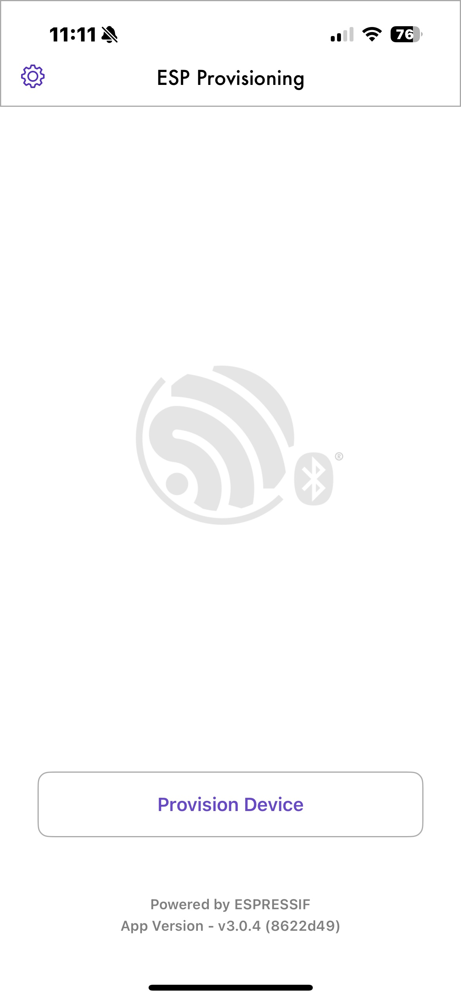
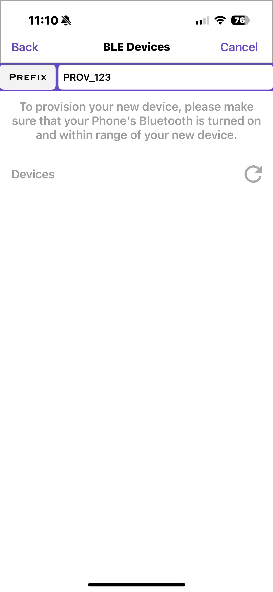
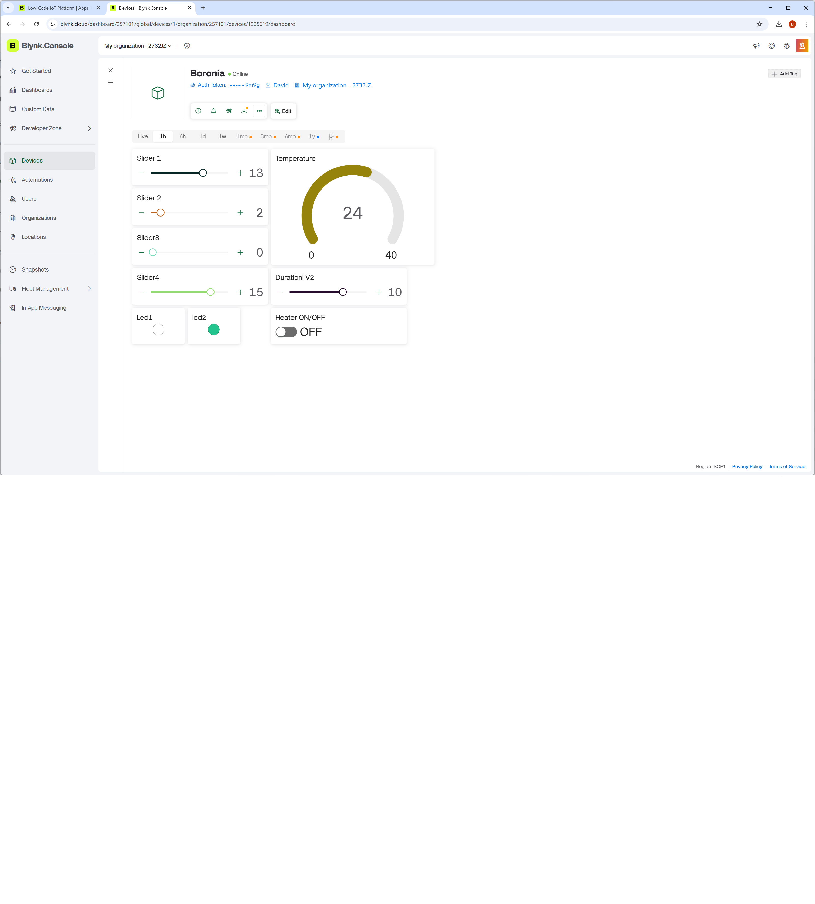
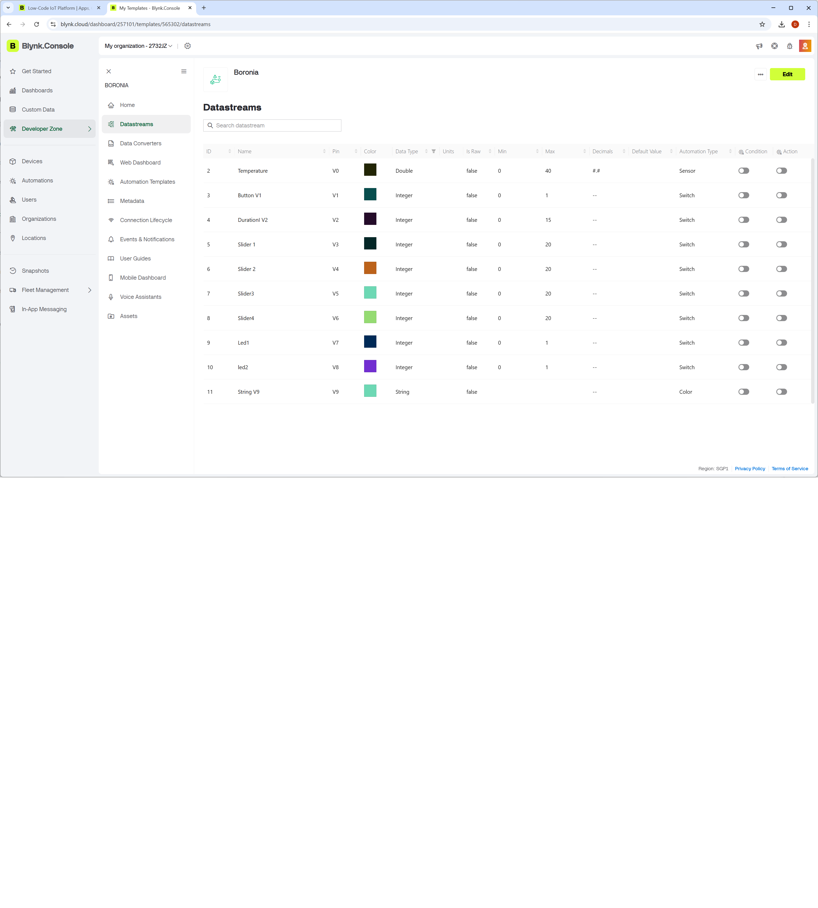
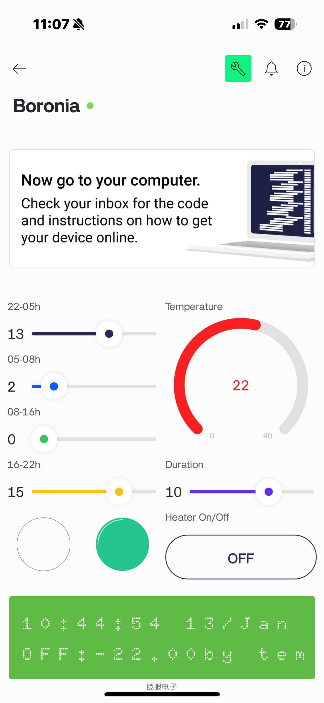

# ESP32

## Introduction

I created a heater temperature control system using Blynk and an ESP32. The ESP32 is a powerful device with WiFi and Bluetooth capabilities. By combining these two, I created an IoT system that allows remote heaters to be turned on and off at specific temperatures and time periods.
This sketch is implemented provisioning using BLE as the mode of transport for provisioning-related communication between the device (to be provisioned) and the client (owner of the device).


## Provisioning Tools


### Provisioning using BLE
```

Provisioning started
Give Credentials of your access point using  of "Android app" or "apple asp" ESP BLE Prov.

Received Wi-Fi credentials
    SSID: your own ssid
    Password: your own password

Connected IP address: 192.168.43.120
Provisioning Successful
Provisioning Ends
```




## Blynk Tools

[Blynk](https://www.blynk.io/) is an excellent platform for solving IoT problems.It is the most powerful tool when you want to control something on the Internet, whether it is on mobile or PC.
By defining the required streams in the Blynk.Console and connecting them to components, you can exchange data over the network.
You must first sign up on https://blynk.cloud/dashboard/login  before you can use it.


After defining the device and setting up the development template through the Blynk console, find out the following three values and enter them at the beginning of the source code: BLYNK TEMPLATE ID, BLYNK TEMPLATE_NAME, and BLYNK AUTHTOKEN.




| define |
|-|
|#define BLYNK_TEMPLATE_ID  "XMgt6fqp4aXvb" |
|#define BLYNK_TEMPLATE_NAME  "TempControl" |
|#define BLYNK_AUTH_TOKEN  "0f0ffASdldldleefeeXXiCNCvQT3Ff3H" |


### Blynk App / Display




## Library
| Library | version | description |
|-|-|-|
| Blynk | 1.3.2 | IoT |
| ESP8266 and ESP32 OLED driver foe SSSD1306 | 4.6.2 | display |
| DallasTemperature | 4.0.5 | temperature sensor  |
| Onewire | 2.3.8 | One wire commucarion  |
| Time | 1.6.1 | date and time  |
| OneButton | 2.6.1 | button switch  |

## Tool
| Tool | version | description |
|-|-|-|
| Autodesk Eagle | 9.6.2 | hardware |
| Autodesk Fusion |     | case desin for 3D printing |
| Arduino IDE | 2.3.7 | software |


## Acknowledgments

I would like to thank to every one for their contributions. 


